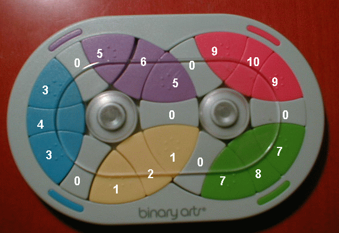

# 704 - Colour Hash

This puzzle consists of two wheels. Both wheels can rotate both clock and counter-clockwise. They
contain 21 coloured pieces, 10 of which are rounded triangles and 11 of which are separators. Figure 1
shows the final position of each one of the pieces. Note that to perform a one step rotation you must
turn the wheel until you have advanced a triangle and a separator.


Figure 1. Final puzzle configuration


Your job is to write a program that reads the puzzle configuration and prints the minimum sequence
of movements required to reach the final position. We will use the following integer values to encode
each type of piece:

0.  grey separator
1.  yellow triangle
2.  yellow separator
3.  cyan triangle
4.  cyan separator
5.  violet triangle
6.  violet separator
7.  green triangle
8.  green separator
9.  red triangle
10. red separator

A puzzle configuration will be described using 24 integers, the first 12 to describe the left wheel
configuration and the last 12 for the right wheel. The first integer represents the bottom right separator
of the left wheel and the next eleven integers describe the left wheel clockwise. The thirteenth integer
represents the bottom left separator of right wheel and the next eleven integers describe the right wheel
counter-clockwise.  
The final position is therefore encoded like:

```
0 3 4 3 0 5 6 5 0 1 2 1 0 7 8 7 0 9 10 9 0 1 2 1
```

If for instance we rotate the left wheel clockwise one position from the final configuration (as shown
in Figure 2) the puzzle configuration would be encoded like:

```
2 1 0 3 4 3 0 5 6 5 0 1 0 7 8 7 0 9 10 9 0 5 0 1
```



Figure 2. The puzzle after rotating the left wheel on step clockwise from the final configuration.


## Input

Input for your program consists of several puzzles. The first line of the input will contain an integer n
specifying the number of puzzles. There will then be n lines each containing 24 integers separated with
one white space, describing the initial puzzle configuration as explained above.


## Output

For each configuration your program should output one line with just one number representing the
solution. Each movement is encoded using one digit from 1 to 4 in the following way:

1.  Left Wheel Clockwise rotation
2.  Right Wheel Clockwise rotation
3.  Left Wheel Counter-Clockwise rotation
4.  Right Wheel Counter-Clockwise rotation

No space should be printed between each digit. Since multiple solutions could be found, you should
print the solution that is encoded as the smallest number. The solution will never require more than
16 movements.  
If no solution is found you should print ‘NO SOLUTION WAS FOUND IN 16 STEPS’. If you are given
the final position you should print ‘PUZZLE ALREADY SOLVED’.


## Sample Input

```
3
0 3 4 3 0 5 6 5 0 1 2 1 0 7 8 7 0 9 10 9 0 1 2 1
0 3 4 5 0 3 6 5 0 1 2 1 0 7 8 7 0 9 10 9 0 1 2 1
0 9 4 3 0 5 6 5 0 1 2 1 0 7 8 7 0 9 10 3 0 1 2 1
```


## Sample Output

```
PUZZLE ALREADY SOLVED
1434332334332323
NO SOLUTION WAS FOUND IN 16 STEPS
```

[\[pdf\]](https://uva.onlinejudge.org/external/7/704.pdf)
