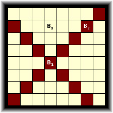

# 861 - Little Bishops

A bishop is a piece used in the game of chess which can only move diagonally from its current 
position. Two bishops attack each other if one is on the path of the other. In the figure
below, the dark squares represent the reachable locations for bishop *B<sub>1</sub>* from its 
current position. Bishops *B<sub>1</sub>* and *B<sub>2</sub>* are in attacking position, while 
*B<sub>1</sub>* and *B<sub>3</sub>* are not. Bishops *B<sub>2</sub>* and *B<sub>3</sub>* are also 
in non-attacking position.



Given two numbers *n* and *k*, determine the number of ways one can put *k* bishops on an 
*n × n* chessboard so that no two of them are in attacking positions.


## Input

The input file may contain multiple test cases. Each test case occupies a single line in the 
input file and contains two integers *n* (1 ≤ *n* ≤ 8) and k (0 ≤ *k* ≤ *n<sup>2</sup>*). 
A test case containing two zeros terminates the input.


## Output

For each test case, print a line containing the total number of ways one can put the given number of
bishops on a chessboard of the given size so that no two of them lie in attacking positions. You may
safely assume that this number will be less than 10<sup>15</sup>.


## Sample Input

```
8 6
4 4
0 0
```


# Sample Output

```
5599888
260
```

[\[pdf\]](https://uva.onlinejudge.org/external/8/861.pdf)
