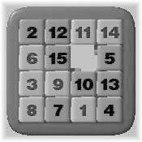

# 10181 - 15-Puzzle Problem

The 15-puzzle is a very popular game; even if you don’t know it by that name, you’ve seen it. It is
constructed with 15 sliding tiles, each with a number from 1 to 15 on it, and all packed into a 4 by 4
frame with one tile missing. The object of the puzzle is to arrange the tiles so that they are ordered as
below:


Here the only legal operation is to exchange missing tile with one of the tiles with which it shares
an edge. As an example, the following sequence of moves changes the status of a puzzle


   

1. A random puzzle position
2. The missing Tile moves to right. Denoted by R
3. The missing Tile moves upwards. Denoted by U
4. The missing Tile moves to the left. Denoted by L

The letters in the previous row indicate which neighbor of the missing tile is swapped with it at
each step; legal values are ‘R’, ‘L’, ‘U’ and ‘D’, for RIGHT, LEFT, UP, and DOWN, respectively.
Given an initial configuration of a 15-puzzle you will have to determine the steps that would make
you reach the final stage. The input 15-puzzles requires at most 45 steps to be solved with our judge
solution. So you will not be allowed to use more than 50 steps to solve a puzzle. If the given initial
configuration is not solvable you just need to print the line ‘This puzzle is not solvable.’


## Input

The first line of the input contains one integer *N*, which indicates how many sets of puzzle, will be
given as input. Next *4N* lines contain *N* sets of inputs. It means four lines make one set of input. Zero
denotes the missing tile.


## Output

For each set of input you will have to give one line of output. If the input puzzle is not solvable then
print the line ‘This puzzle is not solvable.’ If the puzzle is solvable then print the move sequence
as described above to solve the puzzle.


## Sample Input

```
2
2 3 4 0
1 5 7 8
9 6 10 12
13 14 11 15
13 1 2 4
5 0 3 7
9 6 10 12
15 8 11 14
```

## Sample Output

```
LLLDRDRDR
This puzzle is not solvable.
```

[\[pdf\]](https://uva.onlinejudge.org/external/101/10181.pdf)
